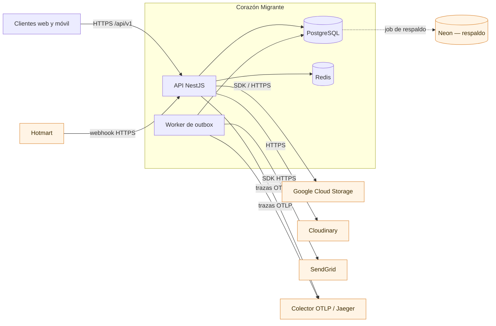

# Mapa de integraciones externas

> Cada integración de esta página está verificada en el código. Se indica el archivo que la
> implementa, cómo se configura, qué ocurre cuando falla y si es sustituible.

## 1. Panorama

## 2. Dependencias de datos

### PostgreSQL

- **Rol:** almacén principal. Todas las entidades del dominio.
- **Cliente:** Sequelize 6 con `pg` 8, dialecto `postgres`.
- **Configuración:** [src/database/database.module.ts](../../src/database/database.module.ts).
  `synchronize: false` y `autoLoadModels: false`: el esquema sólo cambia por migración.
- **Endurecimiento aplicado:** `statement_timeout`, `idle_in_transaction_session_timeout`,
  `connectionTimeoutMillis`, `application_name` y `keepAlive` configurables; SSL con CA opcional en
  base64.
- **Fallo:** el arranque no completa. En caliente, `HttpExceptionFilter` traduce cualquier
  `SequelizeBaseError` no reconocido a `503 SERVICE_UNAVAILABLE`, sin exponer detalles del motor.
- **Sustituible:** no. El dialecto está fijado y las migraciones usan SQL de PostgreSQL.

### Redis

- **Rol:** caché e invalidación por patrón.
- **Cliente:** `ioredis` 5.4.
- **Configuración:** [src/infrastructure/redis](../../src/infrastructure/redis),
  resolución en [src/config/redis.config.ts](../../src/config/redis.config.ts). Acepta `REDIS_URL`
  o parámetros sueltos. Límites explícitos de `SCAN` y de borrado por lote para que una invalidación
  amplia no bloquee el servidor.
- **Fallo:** degradación, no caída. `REDIS_ENABLED=false` desactiva el módulo por completo.
- **Sustituible:** sí, tras la interfaz de `RedisService`.

## 3. Almacenamiento de archivos

Hay **dos proveedores intercambiables**, seleccionados por `STORAGE_PROVIDER` (`GCS` o `CLOUDINARY`,
por defecto `CLOUDINARY`). La elección se resuelve en
[src/config/configuration.ts](../../src/config/configuration.ts) y se aplica en
[src/modules/files/file-storage.service.ts](../../src/modules/files/file-storage.service.ts).

### Google Cloud Storage

- **Cliente:** `@google-cloud/storage` 7.21 (SDK oficial).
- **Credenciales:** [src/config/google-credentials.config.ts](../../src/config/google-credentials.config.ts)
  acepta JSON en base64 o ruta a archivo de clave. Nunca se registran en logs.
- **Buckets:** separa medios de persona usuaria (`GCS_BUCKET_NAME_USER_MEDIA`) de recursos públicos
  (`GCS_BUCKET_NAME_PUBLIC_ASSETS`), con prefijos distintos.
- **URL firmadas:** vigencia configurable, 900 s por defecto.
- **Fallo:** en desarrollo, o si `GCS_UPLOAD_FALLBACK_TO_LOCAL=true`, cae al disco local
  (`UPLOAD_DIR`). En producción sin esa opción, la subida devuelve error.

### Cloudinary

- **Cliente:** HTTP directo con `fetch`, sin SDK
  (`https://api.cloudinary.com/v1_1/{cloud}/auto/upload` y `.../destroy`).
- **Modo de subida directa:** [cloudinary-direct-upload.service.ts](../../src/modules/files/cloudinary-direct-upload.service.ts)
  emite una firma para que el navegador suba el archivo sin pasar por la API.
- **Fallo:** el servicio traduce el error del proveedor a un error de la API; el archivo no se registra.

Ambos dominios están declarados en la política de seguridad de contenido de
[src/main.ts](../../src/main.ts) (`imgSrc`), de modo que el navegador puede mostrar los recursos.

## 4. Correo

### SendGrid

- **Cliente:** `@sendgrid/mail` 8.1.
- **Implementación:** [messaging-provider.service.ts](../../src/modules/messaging/messaging-provider.service.ts).
- **Selección:** `EMAIL_PROVIDER` (o `MAIL_PROVIDER`). El valor por defecto es `DEV_NULL`, que
  descarta el envío: **en desarrollo no se manda correo real salvo configuración explícita.**
- **Validación de configuración:** [env.validation.ts](../../src/config/env.validation.ts) exige
  `SENDGRID_API_KEY` y una dirección de remitente cuando SendGrid está activo. El arranque falla
  antes de aceptar tráfico si falta alguno.
- **Punto de invocación:** sólo el worker de *outbox*. **Ningún handler HTTP envía correo de forma
  síncrona.** Esa es la garantía que da el patrón *outbox*: la respuesta al cliente no depende de la
  disponibilidad de SendGrid.
- **Fallo:** el mensaje queda en `message_outbox` con reintento y retroceso exponencial. Detalle en
  [Reintentos y cola de mensajes fallidos](../events/retries-and-dlq.md).

## 5. Pasarela de contenido de pago

### Hotmart

- **Dirección:** entrante. Es la única integración en la que un tercero llama a este backend.
- **Implementación:** [hotmart.adapter.ts](../../src/modules/downloadables/hotmart.adapter.ts),
  expuesto por `DownloadablesWebhookController`.
- **Qué hace:** traduce una notificación de compra o reembolso en la concesión o revocación de un
  derecho de acceso (`downloadable_entitlement`).
- **Superficie:** una sola ruta pública. Al ser pública y de escritura, concentra riesgo; su
  tratamiento está en [Modelo de amenazas](../security/threat-model.md).
- **Fallo:** el evento se persiste en `downloadable_external_event` antes de procesarse, de modo que
  una notificación puede reprocesarse sin pérdida.

## 6. Observabilidad

### Colector OTLP / Jaeger

- **Cliente:** `@opentelemetry/sdk-node` 0.221 con exportador OTLP sobre HTTP.
- **Instrumentaciones automáticas:** `http`, `express`, `pg`, `ioredis`, `undici`, `pino` y
  `nestjs-core`. Se aplican desde [telemetry.bootstrap.api.ts](../../src/observability/telemetry.bootstrap.api.ts),
  **la primera importación del proceso**: cualquier import anterior rompería el parcheo.
- **Redacción:** [span-redaction.processor.ts](../../src/observability/span-redaction.processor.ts)
  elimina atributos sensibles antes de exportar.
- **Infraestructura local:** `docker-compose.jaeger.yml` y `infra/otel-collector`.
- **Fallo:** degradación silenciosa. Sin colector se pierden las trazas, no las peticiones.

## 7. Respaldo

### Neon

- **Rol:** destino de copia de la base de datos.
- **Implementación:** [scripts/backup-to-neon.js](../../scripts/backup-to-neon.js), programado por
  el workflow `.github/workflows/neon-backup.yml`.
- **Procedimiento y restauración:** [Copia y restauración](../data/backup-and-restore.md).

## 8. Resumen de modo de fallo

| Integración | Dirección | Si falla | ¿Cae la API? |
| --- | --- | --- | --- |
| PostgreSQL | Saliente | Arranque abortado; en caliente `503` | **Sí** |
| Redis | Saliente | Se pierde la caché | No |
| Google Cloud Storage | Saliente | Error de subida, o disco local si hay respaldo activo | No |
| Cloudinary | Saliente | Error de subida | No |
| SendGrid | Saliente (sólo worker) | Reintento con retroceso en el *outbox* | No |
| Hotmart | **Entrante** | El evento queda persistido para reproceso | No |
| Colector OTLP | Saliente | Se pierden las trazas | No |
| Neon | Saliente (job) | Falla el workflow de respaldo | No |

**Única dependencia dura: PostgreSQL.** Todo lo demás degrada sin interrumpir el servicio, que es
una propiedad deliberada del diseño y conviene conservar al añadir integraciones nuevas.

## 9. Variables de entorno que gobiernan cada integración

| Integración | Variables | Referencia |
| --- | --- | --- |
| PostgreSQL | `DATABASE_*` (19 variables) | [Variables de entorno](../getting-started/environment-variables.md) |
| Redis | `REDIS_ENABLED`, `REDIS_URL`, `REDIS_*` | ídem |
| Almacenamiento | `STORAGE_PROVIDER`, `GCS_*`, `CLOUDINARY_*` | ídem |
| Correo | `EMAIL_PROVIDER`, `SENDGRID_API_KEY`, `EMAIL_FROM_*` | ídem |
| Trazas | `OTEL_*` | [Trazas](../observability/tracing.md) |
| Outbox | `OUTBOX_*` | [Semántica de entrega](../events/delivery-semantics.md) |
