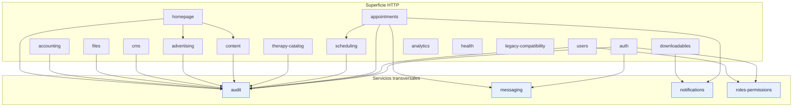

# Dependencias entre módulos

> Derivado del grafo de conocimiento reconstruido sobre el commit `3580196` y verificado contra
> `src/app.module.ts` y los `*.module.ts` de cada dominio. Método y cifras en
> [la auditoría de Graphify](../reports/graphify-audit.md).

## 1. Cómo leer esta página

El backend tiene 19 módulos de dominio bajo `src/modules/` más cuatro módulos de infraestructura
(`DatabaseModule`, `DatabaseBootstrapModule`, `RedisModule`, `ObservabilityModule`). Una dependencia
entre módulos existe cuando un archivo de uno importa un símbolo de otro.

Se distinguen tres clases de dependencia, porque no significan lo mismo:

| Clase | Qué implica | Ejemplo |
| --- | --- | --- |
| **Transversal** | El módulo destino ofrece un servicio técnico que cualquiera puede usar. No crea acoplamiento de negocio. | Todo el mundo escribe en `audit`. |
| **De composición** | El módulo origen orquesta capacidades de otro para construir una vista o un flujo. | `homepage` compone `content` y `advertising`. |
| **De dominio** | El origen necesita reglas de negocio del destino para poder decidir. | `appointments` necesita `scheduling` para saber si hay hueco. |

## 2. Grafo de dependencias

## 3. Matriz de acoplamiento medido

Número de aristas del grafo que cruzan la frontera del módulo. Sólo se listan los pares con
dependencia real.

| Origen | Destino | Aristas | Clase | Qué pasa por esa frontera |
| --- | --- | ---: | --- | --- |
| `advertising` | `audit` | 23 | Transversal | Registro de alta, cambio y baja de campañas, creatividades y emplazamientos. |
| `content` | `audit` | 21 | Transversal | Registro de publicación, despublicación y edición editorial. |
| `files` | `audit` | 15 | Transversal | Registro de subida, descarga y borrado de archivos. |
| `cms` | `audit` | 13 | Transversal | Registro de cambios en páginas y elementos del sitio. |
| `auth` | `audit` | 12 | Transversal | Registro de inicio de sesión, registro y restablecimiento de contraseña. |
| `therapy-catalog` | `audit` | 12 | Transversal | Registro de cambios en productos y enfoques. |
| `users` | `audit` | 11 | Transversal | Registro de cambios de perfil y de asignación de roles. |
| `auth` | `roles-permissions` | 11 | Dominio | Al emitir un token hay que resolver los roles y permisos efectivos de la identidad. |
| `accounting` | `audit` | 10 | Transversal | Registro de asientos, transacciones y ventas. |
| `auth` | `messaging` | 10 | Dominio | El restablecimiento de contraseña encola un correo en el *outbox*. |
| `appointments` | `audit` | 9 | Transversal | Registro de cada transición de estado de una cita. |
| `users` | `roles-permissions` | 9 | Dominio | Asignar y revocar roles a una cuenta. |
| `scheduling` | `audit` | 8 | Transversal | Registro de cambios de horario y bloqueos. |
| `appointments` | `messaging` | 7 | Dominio | Confirmaciones y recordatorios de cita al paciente. |
| `appointments` | `notifications` | 7 | Dominio | Aviso al panel administrativo de citas nuevas o canceladas. |
| `homepage` | `advertising` | 6 | Composición | La portada resuelve qué campañas mostrar en cada emplazamiento. |
| `appointments` | `scheduling` | 6 | Dominio | Comprobar disponibilidad antes de confirmar una reserva. |
| `homepage` | `audit` | 6 | Transversal | Registro de cambios en secciones y destacados. |
| `downloadables` | `notifications` | 6 | Dominio | Aviso de concesión de acceso tras una compra. |
| `homepage` | `content` | 3 | Composición | La portada resuelve qué publicaciones destacar. |

## 4. Propiedades estructurales verificadas

### 4.1 No hay ciclos entre módulos

Ninguna pareja de módulos aparece en ambos sentidos. La dirección del acoplamiento es siempre
`dominio → transversal` o `composición → dominio`, nunca de vuelta.

Esto se sostiene sobre una regla concreta que conviene no romper: **los módulos transversales
(`audit`, `messaging`, `notifications`, `roles-permissions`) no importan nada de los módulos de
dominio.** Si `audit` necesitara alguna vez conocer la forma de una cita, aparecería el primer ciclo
del sistema.

### 4.2 `audit` es un sumidero, no una dependencia de negocio

Diez módulos escriben en `audit` y `audit` no escribe en ninguno. Las 140 aristas entrantes que
acumula no son señal de acoplamiento excesivo: son la huella de que el registro de auditoría cubre
todo el sistema, que es exactamente lo que debe hacer.

### 4.3 `appointments` es el módulo con más dependencias de dominio

Depende de `scheduling`, `messaging`, `notifications` y `audit`. No es accidental: reservar una cita
comprueba disponibilidad, persiste la reserva, notifica a la persona paciente y avisa al panel de
administración, todo dentro de una operación que debe ser consistente. El flujo completo, con sus
transiciones de estado, está en [Flujos críticos de negocio](../business/critical-workflows.md).

### 4.4 Los ciclos que sí existen viven en la capa de modelos

Nueve ciclos de importación entre modelos Sequelize, consecuencia de las asociaciones
bidireccionales del ORM. Están confinados a `src/database/models/` y no cruzan fronteras de módulo.
La decisión y sus consecuencias están en
[ADR-0003 — ORM y modelo de datos](../adr/ADR-0003-orm-y-modelo-de-datos.md).

## 5. Dependencias de infraestructura

Todos los módulos de dominio dependen, directa o indirectamente, de estos cuatro:

| Módulo | Qué aporta | Consecuencia si falla |
| --- | --- | --- |
| `DatabaseModule` | Conexión Sequelize y registro de los 58 modelos. | El arranque no completa; sin base de datos no hay API. |
| `DatabaseBootstrapModule` | Migraciones y *seeds* idempotentes al iniciar. | Con `DATABASE_BOOTSTRAP_FAIL_FAST=true` (por defecto) el arranque aborta. |
| `RedisModule` | Caché e invalidación por patrón. | Degradación: es desactivable con `REDIS_ENABLED=false`. |
| `ObservabilityModule` | Trazas OpenTelemetry y contexto de correlación. | Degradación: se pierde la observabilidad, no el servicio. |

Los cuatro guards globales (`ThrottlerGuard`, `JwtAuthGuard`, `RolesGuard`, `PermissionsGuard`) se
registran en `src/app.module.ts` con `APP_GUARD`, en ese orden. Se aplican a **todas** las rutas
salvo las marcadas con `@Public()`. El orden importa: el límite de peticiones actúa antes que la
autenticación, de modo que un atacante no autenticado no puede agotar recursos de validación de
tokens.

## 6. Reglas de evolución

1. Un módulo de dominio nuevo puede depender de los transversales sin justificación.
2. Una dependencia entre dos módulos de dominio requiere justificarla en la documentación del módulo
   origen, indicando qué regla de negocio la obliga.
3. Ningún módulo transversal puede importar de un módulo de dominio.
4. Una dependencia que crearía un ciclo entre módulos es motivo de rechazo en revisión.
