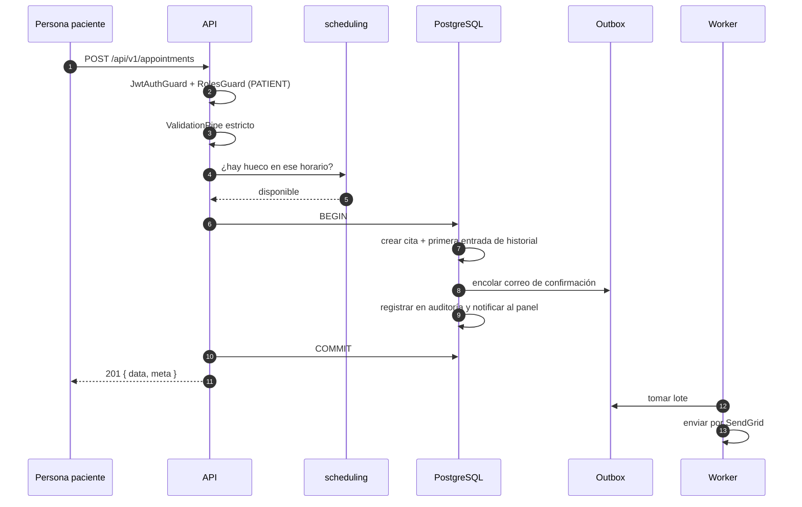
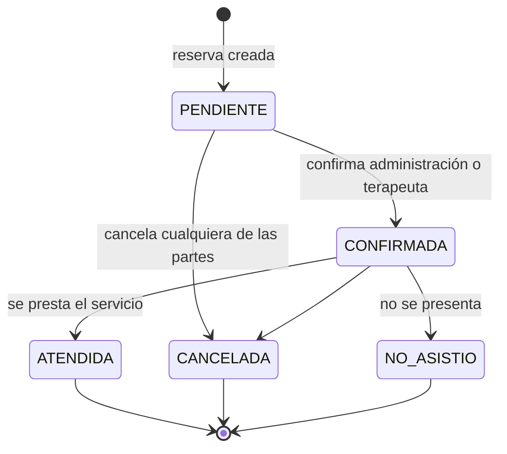
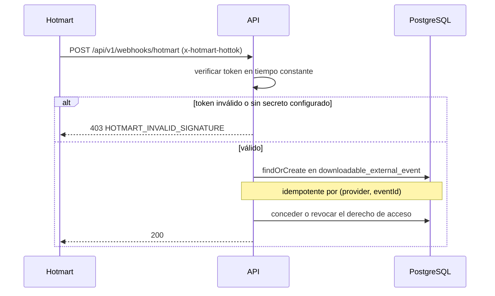

# Flujos críticos de negocio

## 1. Reservar una cita

Es el flujo con más dependencias del sistema: `appointments` coordina `scheduling`, `messaging`,
`notifications` y `audit`.

**Lo que garantiza el diseño:** el correo se encola *dentro* de la transacción. Si la reserva falla,
no se ha prometido nada; si tiene éxito, el correo saldrá aunque SendGrid esté caído en ese instante.

### Reglas

- Sólo el rol `PATIENT` reserva para sí. Reservar para otra persona exige `appointments:write` y rol
  administrativo o de terapeuta.
- `forbidNonWhitelisted` **no es configurable**: relajarlo reabría el agujero por el que se podía
  reservar a nombre de otra persona colando un campo extra.

### Estados

Las transiciones válidas las decide `policies/status-transition.policy.ts`, no condicionales
dispersos, y cada cambio queda en `appointment_status_history`.

## 2. Facturar una cita atendida

La venta se genera **desde la cita atendida**, nunca al reservar:
`POST /api/v1/admin/accounting/transactions/from-appointment/{appointmentId}`.

Facturar una cita que no se prestó sería un error contable, así que la operación es explícita y
posterior. Genera una transacción con sus asientos por partida doble.

## 3. Conceder acceso a un descargable de pago

El evento se persiste **antes** de aplicarse, de modo que una notificación puede reprocesarse sin
pérdida. Ver [modelo de amenazas, A-1](../security/threat-model.md).

## 4. Publicar contenido editorial

`DRAFT → IN_REVIEW → SCHEDULED → PUBLISHED → ARCHIVED`, gobernado por
`policies/publication-status.policy.ts`.

La **visibilidad es una dimensión aparte del estado**: una publicación puede estar `PUBLISHED` y ser
`PREMIUM`, es decir publicada pero legible sólo por quien tenga suscripción activa. La suscripción
premium se aprueba a mano, porque el pago se verifica fuera de banda.

## 5. Restablecer la contraseña

1. `POST /auth/password-reset/request` — **responde igual exista o no la cuenta**, para no
   convertir el endpoint en un verificador de direcciones. Límite: 5 por hora.
2. Si la cuenta existe, se encola el correo en el outbox con un PIN de vigencia limitada
   (`PASSWORD_RESET_EXPIRY_MINUTES`, 15 por defecto).
3. `POST /auth/password-reset/confirm` — valida el PIN y aplica la nueva contraseña.

Los intentos se limitan (`PASSWORD_RESET_MAX_ATTEMPTS`) y todo queda auditado.
