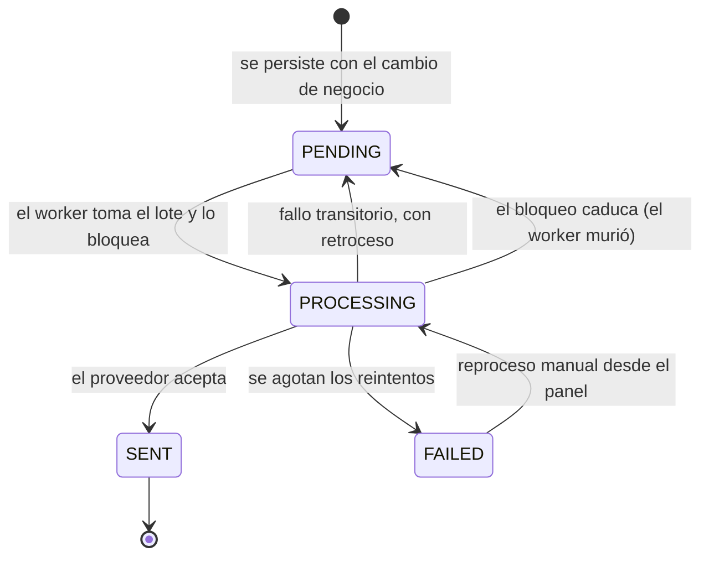

# Semántica de entrega

El backend no usa broker externo. La mensajería asíncrona se apoya en un **outbox transaccional**
sobre PostgreSQL: la intención de enviar se persiste en la **misma transacción** que el cambio de
negocio que la origina.

## Por qué

Sin outbox hay dos formas de equivocarse y ambas ocurren en producción:

1. Enviar el correo **antes** de confirmar la transacción: si la transacción falla, se ha
   notificado algo que no pasó.
2. Enviar **después** de confirmar: si el proceso muere entre el `COMMIT` y el envío, el correo se
   pierde sin rastro.

El outbox elimina las dos: o se guardan el cambio y la intención juntos, o no se guarda ninguno.

## Garantía

**Entrega al menos una vez.** Un mensaje puede enviarse más de una vez si el worker muere después
de que el proveedor lo acepte pero antes de marcarlo como enviado. Los mensajes son notificaciones
por correo, donde un duplicado es molesto pero no dañino; no se ha añadido deduplicación por clave
de idempotencia porque el coste no compensaría al riesgo.

**No hay garantía de orden.** El worker procesa por lotes y los mensajes de un mismo lote pueden
completarse en cualquier orden. Ningún flujo actual depende del orden entre correos.

## Ciclo de vida

## El worker

Es un **proceso independiente** (`src/workers/outbox.worker.ts`, `yarn worker:outbox`), no un
temporizador dentro de la API. Consecuencias buscadas:

- La API puede reiniciarse sin interrumpir el envío, y al revés.
- El worker puede escalarse aparte: el bloqueo por lote permite varias instancias.
- Un fallo del proveedor de correo no consume recursos del servicio HTTP.

`OUTBOX_WORKER_ENABLED=false` lo desactiva; es lo que hacen la generación del contrato y las
pruebas.

## Parámetros

| Variable | Por defecto | Efecto |
| --- | --- | --- |
| `OUTBOX_BATCH_SIZE` | `50` | Mensajes por ciclo |
| `OUTBOX_POLL_INTERVAL_MS` | `2000` | Espera entre ciclos sin trabajo |
| `OUTBOX_STALE_LOCK_MS` | `300000` | Tras este tiempo, un lote bloqueado vuelve a `PENDING` |
| `OUTBOX_SHUTDOWN_TIMEOUT_MS` | `30000` | Margen para terminar el lote en curso al recibir `SIGTERM` |

## Correlación con trazas

El worker propaga el contexto de traza desde la petición HTTP que originó el mensaje, de modo que
un correo enviado minutos después sigue siendo atribuible a la acción que lo provocó. La lógica
está en [`src/observability/messaging-trace.service.ts`](../../src/observability/messaging-trace.service.ts)
y cubierta por `src/modules/messaging/outbox-trace-propagation.spec.ts`.

## Consultar y forzar

| Operación | Para qué |
| --- | --- |
| `GET /api/v1/admin/messaging/outbox` | Ver el estado de la cola |
| `POST /api/v1/admin/messaging/outbox/process` | Forzar el procesamiento del lote pendiente |
| `POST /api/v1/admin/messaging/outbox/{id}/process` | Reenviar un mensaje concreto |
| `POST /api/v1/admin/messaging/test-email` | Validar la configuración del proveedor |

Las rutas también responden bajo `/admin/mensajeria` — el controlador declara ambos prefijos por
compatibilidad con el panel administrativo.

Ver también [reintentos y cola de fallidos](retries-and-dlq.md).
