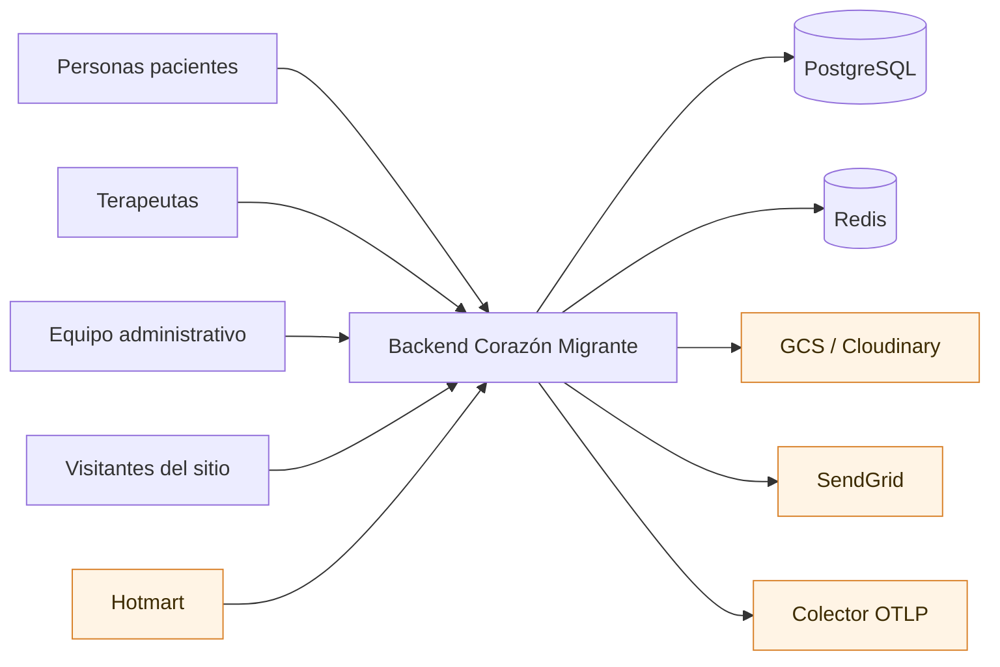

# Backend de Corazón Migrante

Backend de la plataforma de **Corazón Migrante**: agenda terapéutica, catálogo de servicios,
contenidos editoriales, publicidad, recursos descargables de pago, contabilidad y administración del
sitio público.

Atiende a personas migrantes y maneja datos clínicos. Esa es la razón de casi todas las decisiones
que verás documentadas aquí: validación estricta no configurable, autorización de grano fino,
redacción de datos sensibles en logs y trazas, y auditoría transversal.

## De un vistazo

| Dato | Valor |
| --- | --- |
| Framework | NestJS 11 · TypeScript 5.7 en modo estricto |
| Datos | PostgreSQL con Sequelize 6 · Redis para caché |
| Operaciones HTTP | 189 (38 públicas, 151 con token) |
| Módulos de dominio | 19 |
| Entidades persistentes | 57 |
| Pruebas | 290 unitarias · 8 e2e |
| Contrato | OpenAPI 3.1, generado desde el código |

## Contexto del sistema



**Única dependencia dura: PostgreSQL.** Todo lo demás degrada sin interrumpir el servicio, y esa
propiedad conviene conservarla al añadir integraciones. Detalle en el
[mapa de integraciones](architecture/integration-map.md).

## Empezar

| Quiero… | Ir a |
| --- | --- |
| Levantar el proyecto en mi máquina | [Puesta en marcha local](getting-started/local-setup.md) |
| Consumir la API | Referencia interactiva en `/docs` · [autorización](api/authorization.md) |
| Entender por qué existe un módulo | [Índice de módulos](modules/index.md) |
| Entender un flujo de negocio | [Flujos críticos](business/critical-workflows.md) |
| Saber qué datos se guardan | [Catálogo de entidades](data/entity-catalog.md) |
| Responder a un incidente | [Runbooks](operations/runbooks/outbox-detenido.md) |
| Saber qué falta por hacer | [Análisis de brechas](reports/documentation-gap-analysis.md) |
| Saber si esto puede ir a producción | [Preparación para producción](reports/production-readiness.md) |

## Consumir la API

- **Referencia interactiva:** `/docs` (Scalar). Desactivada en producción salvo `SWAGGER_ENABLED=true`.
- **Contrato en crudo:** `/docs/openapi.json`, o `openapi/openapi.yaml` en el repositorio.
- **Prefijo:** `api/v1`. `/health` queda fuera a propósito, porque quien la consulta no conoce el
  prefijo versionado.

Toda respuesta de éxito viaja envuelta: `{ "data": …, "meta": { "requestId", "timestamp" } }`, con
`pagination` en los listados. Los errores son
`{ "error": { "code", "message", "details" }, "meta": … }`.

!!! tip "Ramifica por `error.code`, nunca por `error.message`"
    Los mensajes son texto para la persona usuaria y pueden cambiar sin previo aviso. Los códigos
    son parte del contrato.

## Cómo se mantiene esta documentación

Lo que se puede derivar del código **se deriva**: el contrato OpenAPI, la tabla de rutas con sus
permisos, las páginas de módulo y el catálogo de entidades se generan. Lo que exige criterio se
escribe una sola vez y en un solo sitio.

```bash
yarn docs:openapi:generate   # contrato desde el código (no necesita base de datos)
yarn docs:modules            # páginas de módulo
yarn docs:entities           # catálogo de entidades
yarn docs:validate           # lint del contrato + cobertura + enlaces
```

Las reglas están en la [política de documentación](governance/documentation-policy.md).

## Estado actual

La [línea base](reports/baseline.md) está verde: `verify:ci` correcto, 290 pruebas unitarias, 8 e2e,
cero vulnerabilidades altas o críticas en producción.

Quedan brechas abiertas, todas registradas con su riesgo y su acción concreta en el
[análisis de brechas](reports/documentation-gap-analysis.md). La más relevante es que 188 de 189
operaciones documentan el sobre de respuesta pero todavía no el esquema de la carga útil.
