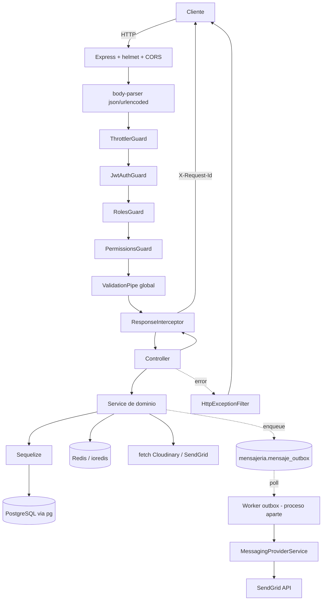

# Fase 0 — Auditoría del estado actual del backend

> Documento previo a cualquier cambio de código. Describe la arquitectura **real**
> detectada en el repositorio, no la arquitectura hipotética del enunciado.

## 1. Identidad del proyecto

| Dato | Valor |
| --- | --- |
| Paquete | `corazon-migrante-backend-reengineered` |
| Versión | `1.0.0` |
| Gestor de paquetes | **Yarn 1.22.22** (`packageManager`, `.yarnrc` con `network-concurrency 1`) |
| Node | `>=20 <27` (local: v22.23.1) |
| Framework | NestJS 11.1.28 |
| TypeScript | 5.7 (`strict: true`, `target: ES2021`, `module: commonjs`) |
| Alias | `@/*` → `src/*` (`tsconfig.json` + `tsc-alias` en build + `moduleNameMapper` en Jest) |

## 2. Tecnologías realmente presentes

| Área | Detectado | Evidencia |
| --- | --- | --- |
| Adaptador HTTP | **Express** (`@nestjs/platform-express`, `NestExpressApplication`) | [src/main.ts:5](../../src/main.ts#L5) |
| ORM | **Sequelize 6 + sequelize-typescript** vía `@nestjs/sequelize` | [src/database/database.module.ts](../../src/database/database.module.ts) |
| Driver SQL | **`pg` 8** (dialect `postgres`) | `package.json`, `dialect: 'postgres'` |
| Cache / Redis | **ioredis 5** (cliente único, `lazyConnect`) | [src/infrastructure/redis/redis.service.ts](../../src/infrastructure/redis/redis.service.ts) |
| Logs | **Pino 10 directo** (no `nestjs-pino`), envuelto en `PinoLoggerService implements LoggerService` | [src/common/logging/pino-logger.service.ts](../../src/common/logging/pino-logger.service.ts) |
| HTTP saliente | **`fetch` global de Node (undici)** hacia Cloudinary; **`@sendgrid/mail`** (usa `https` de Node) | [src/modules/files/file-storage.service.ts:236](../../src/modules/files/file-storage.service.ts#L236) |
| Colas | **Outbox transaccional en PostgreSQL** (`mensajeria.mensaje_outbox`), *no* Bull/BullMQ/RabbitMQ | [src/modules/messaging/messaging.service.ts](../../src/modules/messaging/messaging.service.ts) |
| Workers | **1 worker independiente**: `dist/workers/outbox.worker.js` | [src/workers/outbox.worker.ts](../../src/workers/outbox.worker.ts) |
| Cron / scheduler | **No existe** `@nestjs/schedule`, `node-cron` ni `setInterval` en `src/`. El worker de outbox es un bucle `while` con `delay()` | grep sin resultados |
| Microservicios Nest | No |
| WebSockets | No |
| GraphQL | No |
| Config | `@nestjs/config` global + `configuration.ts` + validación **Joi** (`envValidationSchema`) | [src/config/](../../src/config/) |
| Tests | Jest 29 (`*.spec.ts`) + Supertest (`test/*.e2e-spec.ts`, config aparte) | `jest.config.js`, `test/jest-e2e.json` |
| Docker | `Dockerfile` multi-stage (node:22-bookworm-slim) + `docker-compose.yml` (postgres 16, redis 7, api) | raíz |
| CI | `.github/`, script `verify:ci` | `package.json` |

**Conclusión:** de la lista del enunciado **no** existen Bull/BullMQ, cron jobs,
WebSockets, microservicios ni Axios/`HttpModule`. Se instrumentará lo que existe y
se dejará estructura extensible (ver Fase 12/13) para lo que no.

## 3. Procesos ejecutables

| # | Proceso | Entrypoint | Arranque |
| --- | --- | --- | --- |
| 1 | **API HTTP** | `src/main.ts` → `dist/main.js` | `yarn start:prod` / `CMD` del Dockerfile |
| 2 | **Worker de outbox** | `src/workers/outbox.worker.ts` → `dist/workers/outbox.worker.js` | `yarn worker:outbox` |
| 3 | Bootstrap de BD (migraciones/seeds) | `scripts/deploy-db.mjs` | pre-arranque, proceso corto |

Punto exacto de arranque de cada uno:

- API: `void bootstrap()` en [src/main.ts:115](../../src/main.ts#L115). La **primera**
  importación actual es `import 'dotenv/config'` (línea 1), seguida de NestJS.
- Worker: `void startOutboxWorker()` en [src/workers/outbox.worker.ts:81](../../src/workers/outbox.worker.ts#L81).
  Usa `NestFactory.createApplicationContext(AppModule)` (sin servidor HTTP) — **no** carga
  `dotenv` explícitamente; hereda el `.env` cargado por `AppModule`/`ConfigModule`.

> ⚠️ Riesgo detectado: el worker **no** importa `dotenv/config`; depende de que el
> entorno ya tenga las variables. La telemetría del worker debe cargar dotenv por su
> cuenta antes de leer configuración, igual que hace la API.

API y worker **arrancan por separado** (procesos distintos), pero comparten `AppModule`.
Esto obliga a que cada proceso inicialice su **propio** SDK con un `service.name` distinto.

## 4. Flujo actual de una petición

## 5. Correlación existente

- **Sí existe `requestId`**: `X-Request-Id` se resuelve en
  [src/common/http/request-id.ts](../../src/common/http/request-id.ts) (valida contra
  `^[A-Za-z0-9._-]{1,128}$` para evitar log forging, si no genera `randomUUID`).
- Se emite como header de respuesta y se incluye en el `meta` del cuerpo JSON
  ([ResponseInterceptor](../../src/common/interceptors/response.interceptor.ts) y
  [HttpExceptionFilter](../../src/common/filters/http-exception.filter.ts)).
- **No existe** propagación de contexto entre procesos: cuando la API encola un
  mensaje en el outbox, el worker que lo procesa no tiene ninguna referencia al
  request original. **Este es el principal hueco a cerrar.**
- **No existe** `AsyncLocalStorage` ni contexto de request compartido con los logs:
  el `requestId` se recalcula en cada punto (interceptor y filtro lo derivan del header),
  y los logs de servicios de dominio (`new Logger(X.name)`) **no** lo llevan.

## 6. Manejo de errores y logs

- Filtro global `@Catch()` en `HttpExceptionFilter`, registrado en `main.ts` con
  `useGlobalFilters(new HttpExceptionFilter())` (instancia manual, **sin DI**).
- Interceptor global `ResponseInterceptor`, también instanciado a mano (**sin DI**).

> ⚠️ Riesgo/limitación: ambos se registran con `new ...()` en `main.ts`, así que hoy
> **no pueden inyectar servicios**. Para inyectar el servicio de trazas hay dos vías:
> (a) migrarlos a `APP_FILTER` / `APP_INTERCEPTOR`, lo que cambiaría el orden de
> ejecución respecto a los `APP_GUARD` existentes y es un cambio de riesgo;
> (b) usar la API `trace.getActiveSpan()` de `@opentelemetry/api`, que es un singleton
> global sin estado y no requiere DI. **Se elegirá (b)** para no tocar el arranque.

- Pino ya redacta `password`, `authorization`, `cookie`, `token`, `accessToken`,
  `refreshToken`, `apiKey`, `privateKey`, `private_key`.
- Los cuerpos sólo se serializan si `LOG_LEVEL` es `debug`/`trace`
  (`VERBOSE_PAYLOAD_LOGGING`), y pasan por `sanitizeForLog`.

## 7. Datos sensibles presentes en el dominio

El backend gestiona una plataforma de **terapia psicológica para migrantes**. Circulan:

- Datos de salud: citas terapéuticas, notas para el terapeuta, motivos de consulta.
- Datos personales: nombre, email, teléfono, país de origen.
- Datos financieros: pagos de citas, contabilidad, comprobantes.
- Credenciales: hashes bcrypt, refresh tokens, secretos de Hotmart/SendGrid/Cloudinary/GCS.

**Implicación directa:** está prohibido capturar bodies, query strings completos,
parámetros SQL y headers de autorización en las trazas. Los identificadores de entidad
(UUIDs) sí son admisibles como atributos porque no revelan contenido clínico.

## 8. Endpoints a excluir de las trazas

Rutas realmente existentes (el prefijo global es `api/v1`, con `health` **excluido** del prefijo):

- `GET /health` — liveness/readiness con estado de dependencias.
- `GET /api/v1/health/version`
- `/docs`, `/docs-json` — Swagger (sólo si `SWAGGER_ENABLED`).
- `/favicon.ico`

No existen `/metrics`, `/healthz`, `/ready`, `/liveness`; se dejarán igualmente en la
lista de exclusión por robustez ante despliegues futuros (Coolify/Render usan `/health`).

## 9. Arquitectura de despliegue

- `docker-compose.yml`: postgres:16-alpine, redis:7-alpine, api (build local).
- `Dockerfile`: multi-stage con `node:22-bookworm-slim`, `PORT=3003`, ejecuta
  `deploy-db.mjs` + `node dist/main.js`.
- `render.yaml` y `nixpacks.toml` presentes (despliegues alternativos).
- Producción real: VPS con Coolify (según commits recientes y `.env.production.example`).

**Implicación:** el Collector y Jaeger deben poder alcanzarse por nombre de servicio
dentro de la red Docker y por `localhost` fuera de ella.

## 10. Puntos de instrumentación identificados

| Punto | Mecanismo | Fase |
| --- | --- | --- |
| Petición HTTP entrante | `@opentelemetry/instrumentation-http` + `-express` | 4 |
| Controller / handler Nest | `@opentelemetry/instrumentation-nestjs-core` | 4 |
| Consultas PostgreSQL | `@opentelemetry/instrumentation-pg` | 4 / 9 |
| Sequelize | **sin instrumentación oficial**; se cubre vía `pg` + spans de negocio | 9 |
| Redis | `@opentelemetry/instrumentation-ioredis` | 4 / 10 |
| HTTP saliente (`fetch`/undici, SendGrid) | `@opentelemetry/instrumentation-http` (cubre `https` de Node, usado por `@sendgrid/mail`) + `undici` para `fetch` | 11 |
| Logs Pino | `@opentelemetry/instrumentation-pino` (inyecta `trace_id`/`span_id`) | 6 |
| Header `x-trace-id` | interceptor propio | 6 |
| Errores | filtro/interceptor propios sobre `trace.getActiveSpan()` | 7 |
| Outbox → worker | inyección/extracción manual de `traceparent` en `payload._trace` | 12 |
| Operaciones de negocio | `TracingService.runInSpan` | 8 |

## 11. Riesgos

| # | Riesgo | Mitigación |
| --- | --- | --- |
| R1 | Instrumentación cargada tarde → parches no aplicados | Import de bootstrap como **primerísima** línea de `main.ts` y del worker, antes de `dotenv` |
| R2 | El worker no carga `dotenv` | El bootstrap de telemetría carga `dotenv/config` él mismo (idempotente) |
| R3 | Interceptor/filtro sin DI | Usar `trace.getActiveSpan()` (singleton global), sin cambiar el registro en `main.ts` |
| R4 | `main.ts` importa `@/...`? No: usa rutas relativas → seguro para el bootstrap | — |
| R5 | Doble span pg + sequelize | No se instala instrumentación de Sequelize (tercero, no oficial) |
| R6 | Jaeger caído bloqueando peticiones | `BatchSpanProcessor` (asíncrono) + timeout de export + `diag` a nivel ERROR |
| R7 | Validación Joi estricta rechaza las nuevas variables | Añadirlas explícitamente a `envValidationSchema` (Joi por defecto no permite claves desconocidas… **verificado**: el schema no usa `.unknown(false)`, pero `@nestjs/config` valida con `allowUnknown: true` por defecto; aun así se añaden para documentarlas y validarlas) |
| R8 | `payload._trace` en el outbox se expone en la API de mensajería | Se filtra en `toApiOutbox` |
| R9 | El check `check:validation-strict` o `check:secrets` falla con archivos nuevos | Verificar tras cada fase con `yarn verify:ci` parcial |
| R10 | Cobertura Jest mínima (30 % líneas) podría bajar al añadir código nuevo sin tests | Se añaden specs para todo el módulo de observabilidad |
| R11 | `instrumentation-pino` requiere que Pino se cargue **después** del SDK | El bootstrap va antes de cualquier import de `pino` |

## 12. Plan de implementación adaptado

1. Dependencias mínimas (instrumentaciones individuales, **no** `auto-instrumentations-node`,
   para no arrastrar ~30 paquetes sin uso: kafka, mongo, mysql, aws, etc.).
2. `src/observability/telemetry.bootstrap.ts` importado como primera línea de
   `main.ts` y `workers/outbox.worker.ts`.
3. Módulo Nest `ObservabilityModule` con `TracingService` (fachada sin acoplamiento a Jaeger).
4. Correlación Pino ↔ trazas y header `x-trace-id`.
5. Marcado de errores en el filtro existente.
6. Spans de negocio en auth, citas, mensajería, descargables.
7. Propagación explícita outbox → worker vía `payload._trace`.
8. `docker-compose.jaeger.yml` + config de Collector.
9. Tests unitarios con `InMemorySpanExporter` + e2e con Supertest.
10. Documentación y runbook.

## 13. Archivos que **serán** modificados

| Archivo | Motivo |
| --- | --- |
| `package.json` | dependencias + scripts `jaeger:*`, `verify:jaeger` |
| `yarn.lock` | resolución de las nuevas dependencias |
| `src/main.ts` | primera línea: import del bootstrap; registro del interceptor de trazas |
| `src/workers/outbox.worker.ts` | primera línea: import del bootstrap; span raíz por ciclo |
| `src/app.module.ts` | importar `ObservabilityModule` |
| `src/config/configuration.ts` | sección `otel` |
| `src/config/env.validation.ts` | validación Joi de las variables `OTEL_*` |
| `src/common/filters/http-exception.filter.ts` | marcar el span activo como error |
| `src/common/interceptors/response.interceptor.ts` | **no se toca** (se añade un interceptor propio) |
| `src/modules/messaging/messaging.service.ts` | inyección/extracción de contexto + spans producer/consumer |
| `src/modules/auth/auth.service.ts` | spans `auth.*` |
| `src/modules/appointments/appointments.service.ts` | span `appointment.create` |
| `src/modules/downloadables/downloadables.service.ts` | span `downloadable.access.evaluate` y `downloadable.hotmart.notification` |
| `.env.example`, `.env.production.example` | nuevas variables documentadas |
| `docker-compose.yml` | servicio Jaeger opcional vía perfil (sin romper el actual) |
| `Dockerfile` | copiar `dist/observability` (ya incluido en `dist`), sin cambios estructurales |
| `README.md` | enlace a la documentación de observabilidad |

## 14. Archivos que **no** deben modificarse

- `src/database/models/**` — el esquema legacy está alineado con tablas en español;
  no se añaden columnas para trazas (se usa el JSONB `payload` existente).
- `src/database/migrations/**` — cero migraciones nuevas.
- `src/common/guards/**` — la cadena de autorización no se altera.
- `src/common/logging/log-sanitizer.ts` — la política de saneado ya es correcta.
- `scripts/smoke-*.{mjs,ps1,sh}` — pruebas de humo funcionales ajenas a observabilidad.
- Cualquier `*.dto.ts` — no se cambian contratos de entrada/salida.
- `openapi.yml` — el header `x-trace-id` es de respuesta y no altera el contrato de datos.

## 15. Criterio de aceptación de la Fase 0

✅ Se conoce el entrypoint exacto de cada proceso (`src/main.ts`, `src/workers/outbox.worker.ts`),
cómo se arranca cada uno, qué librerías reales hay que parchear y qué datos sensibles
existen. Se puede empezar la Fase 1.
