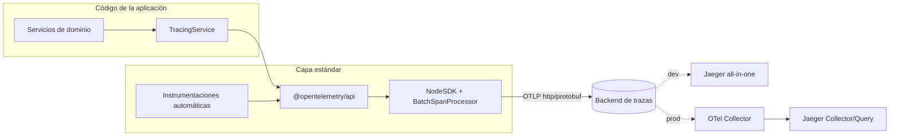
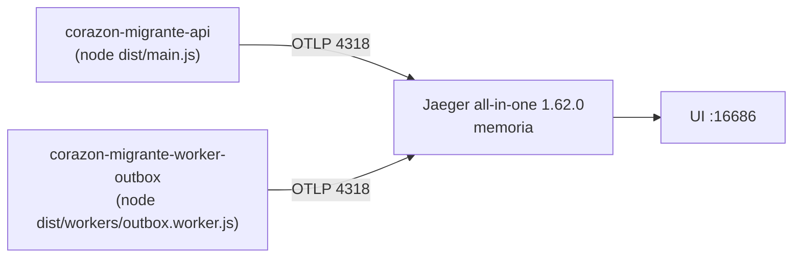
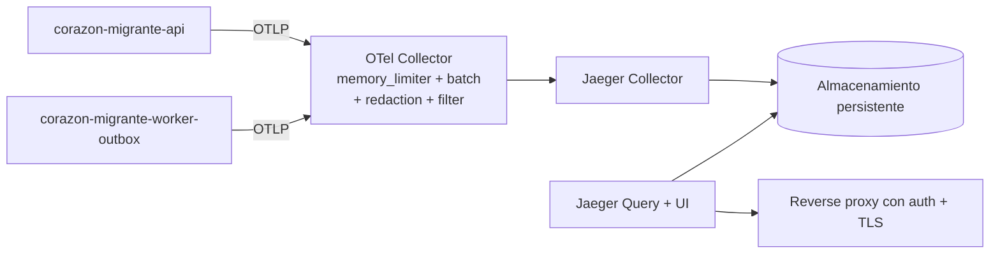
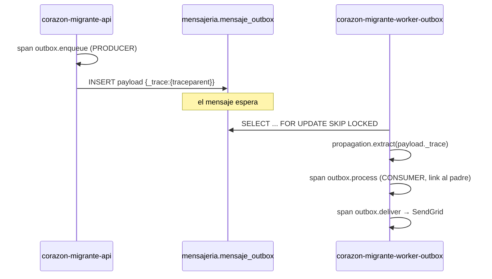

# Fase 1 — Diseño de la arquitectura de observabilidad

## 1. Principio rector

El dominio **no conoce Jaeger**. Conoce, como mucho, una fachada propia
(`TracingService`). Jaeger es un detalle de despliegue intercambiable por Tempo,
Zipkin, Datadog o cualquier backend que hable OTLP.



## 2. Topología

### Desarrollo



### Producción



## 3. Decisiones

### D1 — Protocolo: **OTLP `http/protobuf`** (puerto 4318)

| Alternativa | Ventajas | Riesgos | Decisión |
| --- | --- | --- | --- |
| `http/protobuf` | Sin dependencias nativas; atraviesa proxies HTTP (Coolify/Render/Cloudflare) sin configuración especial; una sola dependencia (`exporter-trace-otlp-http`) | Levemente más verboso que gRPC | ✅ **Elegida** |
| `grpc` | Menor overhead, streaming | Arrastra `@grpc/grpc-js`; los reverse proxies de la infra actual (Coolify) no están configurados para HTTP/2 de extremo a extremo | ❌ |

El VPS con Coolify ya expone servicios por HTTP; usar el mismo transporte evita un
punto de fallo operativo nuevo.

### D2 — Instrumentaciones: **paquetes individuales**, no `auto-instrumentations-node`

`@opentelemetry/auto-instrumentations-node` instala ~30 instrumentaciones (kafka,
mongodb, mysql, aws-sdk, cassandra, memcached, graphql, restify, hapi, koa…) de las
cuales el proyecto usa **6**. Instalarlas violaría la regla «no agregar paquetes sin
uso real» y ampliaría innecesariamente la superficie de dependencias de un backend
que maneja datos de salud.

Instrumentaciones activas:

| Paquete | Cubre |
| --- | --- |
| `instrumentation-http` | peticiones entrantes y salientes por `http`/`https` (incluye `@sendgrid/mail`) |
| `instrumentation-undici` | `fetch` global de Node 22 (Cloudinary) |
| `instrumentation-express` | capas de middleware y routing |
| `instrumentation-nestjs-core` | controllers, handlers, guards, interceptors |
| `instrumentation-pg` | consultas a PostgreSQL |
| `instrumentation-ioredis` | comandos Redis |
| `instrumentation-pino` | inyección de `trace_id`/`span_id` en los logs |

Explícitamente **no** se instrumenta: `fs` (ruido masivo, cero valor), `dns`, `net`.

### D3 — Sequelize: sin instrumentación dedicada

No existe instrumentación **oficial** de Sequelize en `opentelemetry-js-contrib`.
Las alternativas de terceros (`opentelemetry-instrumentation-sequelize`) están
desalineadas con la versión actual del SDK y añaden un span redundante por cada span
de `pg`. La consulta real —la que consume latencia— la emite `instrumentation-pg`
con `db.system`, `db.namespace` y `db.operation.name`. Donde una operación de
Sequelize agrupa varias consultas (transacciones), se envuelve con un span de negocio
manual, que aporta más información que un span genérico `sequelize.findAll`.

### D4 — Nombres de servicio

Convención `<producto>-<componente>`:

| Proceso | `service.name` |
| --- | --- |
| API HTTP | `corazon-migrante-api` |
| Worker de outbox | `corazon-migrante-worker-outbox` |

- `service.namespace`: `corazon-migrante`
- `service.version`: `OTEL_SERVICE_VERSION`, por defecto la `version` de `package.json`
- `deployment.environment.name`: `OTEL_DEPLOYMENT_ENVIRONMENT`, por defecto `NODE_ENV`

### D5 — Muestreo: `parentbased_traceidratio`

Respeta la decisión del servicio aguas arriba y aplica un ratio configurable a las
trazas raíz. Ratio por variable de entorno, nunca hardcodeado.

| Entorno | `OTEL_TRACES_SAMPLER_ARG` sugerido | Razón |
| --- | --- | --- |
| development | `1.0` | volumen nulo, se quiere ver todo |
| test | telemetría desactivada (`OTEL_ENABLED=false`) o exportador en memoria | los tests no deben abrir sockets |
| staging | `0.5` | tráfico bajo |
| production | `0.15` (punto de partida) | ajustar según volumen real; ver Fase 17 |

### D6 — Propagadores: `tracecontext,baggage`

W3C Trace Context es el estándar y lo entiende cualquier backend moderno. `baggage`
se habilita para poder propagar metadatos de bajo riesgo entre procesos. **B3 no se
habilita**: no hay ningún sistema heredado que lo requiera.

### D7 — Convenciones de nombres de span

**Spans de negocio:** `<dominio>.<acción>`, en minúsculas, **sin IDs**.

```
auth.register-patient      appointment.create          outbox.enqueue
auth.login                 appointment.update-status   outbox.publish
auth.refresh               appointment.update-payment  outbox.process
auth.logout                downloadable.evaluate-access
                           downloadable.hotmart-notification
```

Prohibido: `auth.login.usr_8f21…`, `appointment.create.3871`.

**Atributos propios** — namespace `app.*`:

| Atributo | Tipo | Cardinalidad | Ejemplo |
| --- | --- | --- | --- |
| `app.module` | string | baja (≈20) | `auth`, `appointments`, `messaging` |
| `app.operation` | string | baja | `login`, `create`, `process` |
| `app.entity.type` | string | baja | `appointment`, `user`, `outbox-message` |
| `app.entity.id` | string | **alta** — sólo como atributo, jamás en el nombre | `a3f1…` |
| `app.job.name` | string | baja | `outbox-poll` |
| `app.job.attempt` | int | baja | `3` |
| `app.event.type` | string | baja | `SMOKE_TEST_EMAIL` |
| `app.result` | string | baja | `granted`, `denied`, `sent`, `failed` |
| `app.batch.size` | int | baja | `50` |

### D8 — Atributos prohibidos

Nunca como atributo ni como evento: contraseñas, hashes de contraseña, tokens de
acceso/refresco, cookies, `Authorization`, claves de API, cuerpos de petición o
respuesta, direcciones de correo (se usa el ID de usuario), notas clínicas, motivos
de consulta, importes con identificador de pagador, documentos de identidad, SQL con
valores, variables de entorno. Política completa en
[04-data-privacy-policy.md](04-data-privacy-policy.md).

### D9 — Política de errores

1. La instrumentación automática marca el span técnico (HTTP 5xx, error de `pg`).
2. `TracingService.runInSpan` registra la excepción **una sola vez** en el span que él
   mismo creó, marca `SpanStatusCode.ERROR` y **re-lanza** el error sin alterarlo.
3. `HttpExceptionFilter` marca el span **activo** (no lo crea ni lo finaliza) sólo
   cuando el error normaliza a 5xx; los 4xx son comportamiento esperado del contrato y
   no ensucian la tasa de error. Registra `exception.type` y el `code` normalizado,
   nunca el stack completo hacia el cliente.

Esto evita la duplicación de «la misma excepción cinco veces».

### D10 — Estrategia de cierre

`telemetry.shutdown` registra manejadores `SIGTERM`/`SIGINT` **una sola vez**, llama a
`sdk.shutdown()` con un timeout y **no** invoca `process.exit()`: devolver el control al
proceso deja que Nest ejecute sus `onApplicationShutdown` existentes. Si el shutdown
falla, se registra por `diag` y se continúa.

### D11 — Estrategia para el worker y la cola

El outbox es una cola **en PostgreSQL**, no un broker. El contexto se propaga
inyectando el carrier W3C en la clave reservada `_trace` del `payload` JSONB existente
—**sin migración de base de datos**—:



Compatibilidad: si `payload._trace` no existe (mensajes anteriores al despliegue), el
span consumidor se crea como **raíz** y el procesamiento continúa con normalidad.

El span consumidor se enlaza al productor mediante **`links`** y no como hijo directo,
porque el productor ya terminó cuando el consumidor arranca y la duración de la traza
padre no debe incluir el tiempo en cola. Se sigue compartiendo `trace_id` a través del
link, que es la relación semánticamente correcta para mensajería asíncrona diferida.

### D12 — Estrategia para logs

Se mantiene Pino. `instrumentation-pino` inyecta `trace_id`, `span_id` y `trace_flags`
en cada registro **cuando hay un span activo**, sin duplicar logs ni cambiar el
formato JSON. Requisito: el SDK debe inicializarse antes de que se cargue `pino`, lo
que se garantiza con el import temprano.

### D13 — Desactivación

`OTEL_ENABLED=false` ⇒ no se crea `NodeSDK`, no se aplica ningún parche, no se abre
ningún socket. `TracingService` sigue funcionando: la API `@opentelemetry/api` sin SDK
registrado devuelve spans no-op, así que el código de dominio no necesita ramas
condicionales. Este es el modo por defecto en tests.

### D15 — Sólo trazas: métricas y logs OTLP desactivados

`NodeSDK` levanta por defecto también los pipelines OTLP de métricas y logs.
Jaeger sólo expone `/v1/traces`, así que el exportador registraba un
`404 Not Found` periódico (detectado ejecutando el backend contra un Jaeger real).
`enforceTracesOnlyPipelines()` fija `OTEL_METRICS_EXPORTER=none` y
`OTEL_LOGS_EXPORTER=none`, respetando el valor si el operador lo define
explícitamente —para no impedir que en el futuro se apunte a un Collector que sí
acepte métricas.

### D16 — Saneado de atributos en la aplicación, no sólo en el Collector

La redacción en el Collector es la segunda barrera, pero en desarrollo no hay
Collector y en producción una configuración errónea del mismo dejaría datos
sensibles saliendo del proceso. Por eso el saneado también ocurre **dentro de la
aplicación**, con `SpanRedactionProcessor` encadenado antes del
`BatchSpanProcessor`.

Motivo concreto: dos fugas reales que sobrevivían a la configuración de las
instrumentaciones —el query string en `url.full` y los literales de SQL en
`db.query.text`, porque Sequelize los interpola en la sentencia en vez de usar
parámetros ligados. Detalle en
[04-data-privacy-policy.md](04-data-privacy-policy.md) §4.1.

Alternativa evaluada: usar `SpanExporter` envolvente en lugar de un
`SpanProcessor`. Se descartó porque obligaría a reimplementar el contrato del
exportador OTLP; el procesador encadenado muta los atributos y el exportador
recibe ya la versión saneada, sin acoplarse a él.

### D14 — Registro del interceptor y del filtro

`main.ts` registra hoy `new HttpExceptionFilter()` y `new ResponseInterceptor()` sin DI.
Migrarlos a `APP_FILTER`/`APP_INTERCEPTOR` alteraría el orden respecto a los cuatro
`APP_GUARD` existentes y es un riesgo funcional no solicitado. Por eso:

- El nuevo `TraceResponseInterceptor` se registra igual que el existente
  (`useGlobalInterceptors`), instanciado a mano, y obtiene el trace ID vía
  `trace.getActiveSpan()` — un singleton global que no requiere inyección.
- `HttpExceptionFilter` usa la misma API sin cambiar su firma ni su registro.

**La cabecera se fija desde dos sitios**, y no es duplicación: cubren caminos
disjuntos del pipeline de NestJS. Los interceptores **no se ejecutan** cuando la
ruta no existe (404) ni cuando un guard rechaza la petición (401/403) —
comprobado con el backend en marcha: esas respuestas salían sin `x-trace-id`.
Son justo los errores que un usuario acaba reportando a soporte, así que el
filtro de excepciones invoca el mismo helper `setTraceIdHeader`.

`TracingService` **sí** se expone por DI a través de `ObservabilityModule` (global),
para los servicios de dominio.

## 4. Contrato de la fachada

```ts
runInSpan<T>(name: string, attributes: Attributes, fn: (span: Span) => Promise<T> | T): Promise<T>
runInSpanSync<T>(name: string, attributes: Attributes, fn: (span: Span) => T): T
getActiveTraceId(): string | undefined
getActiveSpanId(): string | undefined
setAttributes(attributes: Attributes): void
addEvent(name: string, attributes?: Attributes): void
recordException(error: unknown): void
```

Y para mensajería, un servicio aparte (`MessagingTraceService`):

```ts
inject(): TraceCarrier | undefined
runAsConsumer<T>(name: string, carrier: unknown, attributes: Attributes, fn: (span: Span) => Promise<T>): Promise<T>
```

## 5. Variables de entorno

| Variable | Defecto | Descripción |
| --- | --- | --- |
| `OTEL_ENABLED` | `false` | Interruptor maestro. `false` ⇒ cero instrumentación |
| `OTEL_SERVICE_NAME` | `corazon-migrante-api` | Sobrescrito a `…-worker-outbox` por el worker |
| `OTEL_SERVICE_NAMESPACE` | `corazon-migrante` | |
| `OTEL_SERVICE_VERSION` | `version` de `package.json` | |
| `OTEL_DEPLOYMENT_ENVIRONMENT` | `NODE_ENV` | |
| `OTEL_EXPORTER_OTLP_PROTOCOL` | `http/protobuf` | Sólo se soporta este valor |
| `OTEL_EXPORTER_OTLP_TRACES_ENDPOINT` | `http://localhost:4318/v1/traces` | |
| `OTEL_EXPORT_TIMEOUT_MS` | `10000` | |
| `OTEL_TRACES_SAMPLER` | `parentbased_traceidratio` | también `always_on`, `always_off`, `traceidratio` |
| `OTEL_TRACES_SAMPLER_ARG` | `1.0` | ratio `[0,1]` |
| `OTEL_PROPAGATORS` | `tracecontext,baggage` | |
| `OTEL_DIAG_LOG_LEVEL` | `ERROR` | `NONE\|ERROR\|WARN\|INFO\|DEBUG\|VERBOSE\|ALL` |
| `OTEL_EXCLUDED_URLS` | `/health,/healthz,/ready,…` | lista separada por comas |
| `OTEL_SHUTDOWN_TIMEOUT_MS` | `5000` | |

Todas se validan con Joi en `env.validation.ts` y se exponen por `ConfigService`
bajo la clave `otel.*`. El bootstrap es la **única** excepción que lee `process.env`
directamente, porque se ejecuta antes de que exista el contenedor de Nest — hecho
documentado y aislado en un único archivo (`telemetry.config.ts`).

## 6. Criterio de aceptación de la Fase 1

✅ Decisiones tomadas, justificadas y con alternativas evaluadas. Se puede instalar.
