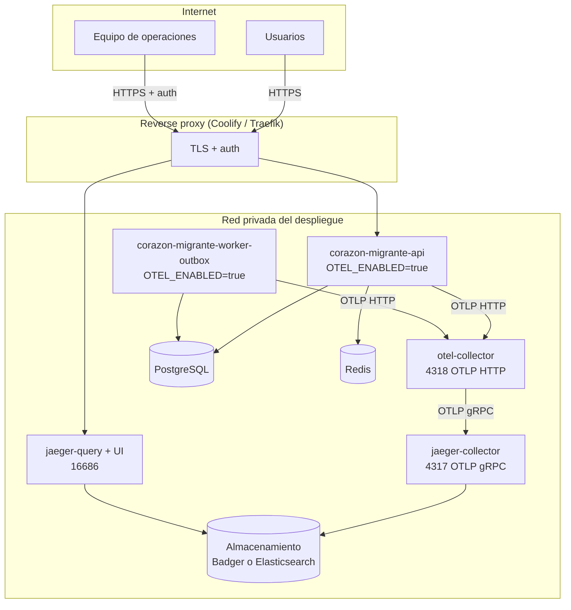

# Fase 16 — Topología de producción

> El `all-in-one` con almacenamiento en memoria que usa `docker-compose.jaeger.yml`
> es **exclusivamente** para desarrollo: pierde todo al reiniciar y no tiene
> autenticación. Nunca debe desplegarse en producción.

## 1. Topología



## 2. Componentes

| Componente | Imagen sugerida | Función | Puertos |
| --- | --- | --- | --- |
| `otel-collector` | `otel/opentelemetry-collector-contrib:0.115.1` | Recepción OTLP, límite de memoria, redacción, batching, cola en disco | 4317, 4318 (interno), 13133 health, 8888 métricas internas |
| `jaeger-collector` | `jaegertracing/jaeger-collector:1.62.0` | Ingesta y escritura al almacenamiento | 4317 (interno), 14269 admin |
| `jaeger-query` | `jaegertracing/jaeger-query:1.62.0` | API de consulta y UI | 16686 (sólo tras el proxy) |
| Almacenamiento | Badger (volumen) o Elasticsearch 8.x | Persistencia de trazas | — |

Todas las imágenes con **etiqueta explícita**. `latest` está prohibido: un cambio
upstream no debe alterar producción sin un commit.

## 3. Elección de almacenamiento

| Opción | Ventajas | Riesgos | Veredicto |
| --- | --- | --- | --- |
| **Badger** (integrado en Jaeger, disco local) | Cero componentes nuevos; un volumen basta; retención por TTL nativa; consumo mínimo | Nodo único, sin alta disponibilidad; no escala horizontalmente | ✅ **Elegido para el arranque.** El volumen previsto (unidad de terapia, decenas de miles de peticiones/día, muestreo 15 %) cabe holgadamente. |
| Elasticsearch / OpenSearch | Alta disponibilidad, búsquedas avanzadas, retención por ILM | Cluster nuevo que operar, ≥2 GB RAM por nodo, coste y complejidad desproporcionados para el volumen actual | ⏸ Migrar sólo si se superan ~50 GB de trazas o si se exige HA. |
| Cassandra | Muy escalable | Operación pesada, sin equipo con experiencia | ❌ |

Justificación exigida por la Fase 16:

- **Volumen estimado:** con muestreo 0.15 y un tamaño medio de ~4 KB por traza,
  10 000 peticiones/día ⇒ ~1 500 trazas/día ⇒ ~6 MB/día ⇒ ~45 MB con 7 días de
  retención. Un volumen de 5 GB deja margen de dos órdenes de magnitud.
- **Retención:** 7 días (ver [04-data-privacy-policy.md](04-data-privacy-policy.md)).
- **Coste:** un volumen de disco frente a un cluster; diferencia de un orden de magnitud.
- **Complejidad operativa:** Badger no añade ningún proceso que monitorizar aparte de Jaeger.
- **Disponibilidad:** la observabilidad no es un servicio crítico de negocio; una
  caída de Jaeger no afecta a la atención de pacientes (ver sección 6).
- **Compatibilidad:** Badger es un backend soportado oficialmente por Jaeger.

Configuración de retención en `jaeger-collector` / `jaeger-query`:

```env
SPAN_STORAGE_TYPE=badger
BADGER_EPHEMERAL=false
BADGER_DIRECTORY_VALUE=/badger/data
BADGER_DIRECTORY_KEY=/badger/key
BADGER_SPAN_STORE_TTL=168h   # 7 días
```

## 4. Redes y seguridad

| Regla | Implementación |
| --- | --- |
| El Collector no se publica | Sin `ports:` hacia el host; sólo alcanzable por nombre de servicio en la red interna |
| OTLP nunca sale a Internet | `OTEL_EXPORTER_OTLP_TRACES_ENDPOINT=http://otel-collector:4318/v1/traces` |
| La UI exige autenticación | Basic auth o SSO en el reverse proxy delante de `jaeger-query:16686` |
| TLS de extremo a extremo hacia la UI | Certificado gestionado por el proxy |
| TLS entre Collector y Jaeger | `tls.insecure: false` en el exportador del Collector |
| Sin secretos en la configuración | El Collector no necesita credenciales de la aplicación |

## 5. Escalabilidad

- **API y worker:** ya escalan por réplicas. Cada réplica exporta al mismo
  Collector; `service.instance.id` los distingue vía `envDetector` si se define
  `OTEL_RESOURCE_ATTRIBUTES`.
- **Collector:** escala horizontalmente sin estado (la cola en disco es por
  instancia). Si se satura, la primera palanca es bajar `OTEL_TRACES_SAMPLER_ARG`.
- **Jaeger:** `jaeger-collector` y `jaeger-query` son procesos independientes y
  se pueden replicar por separado. Con Badger, el almacenamiento es el límite;
  ese es el punto de migración a Elasticsearch.

## 6. Estrategia de recuperación

La regla arquitectónica es que **una petición de negocio nunca depende de que el
sistema de trazas esté vivo**:

| Fallo | Comportamiento | Recuperación |
| --- | --- | --- |
| Jaeger caído | El Collector encola en disco (`file_storage/queue`, 5 000 elementos). La API no se entera. | Automática al volver Jaeger; se vacía la cola. |
| Collector caído | El `BatchSpanProcessor` de la aplicación reintenta y descarta al llenar su búfer. **Las peticiones siguen respondiendo con normalidad** (verificado: exportador inalcanzable ⇒ proceso vivo y exit code 0). | Automática. Se pierden las trazas del intervalo. |
| Almacenamiento lleno | El TTL de Badger purga automáticamente. | Monitorizar el volumen; alerta al 80 %. |
| Fuga de datos sensibles | Ver procedimiento en [04-data-privacy-policy.md](04-data-privacy-policy.md) §8. | Manual. |
| Sobrecarga por volumen de trazas | Bajar `OTEL_TRACES_SAMPLER_ARG` (no requiere cambio de código). | Reinicio de la API. |

**Backups:** las trazas **no** se respaldan. Son datos de diagnóstico con 7 días
de vida; el coste y el riesgo de privacidad de conservarlas en backup superan
cualquier beneficio. Lo que sí se respalda es PostgreSQL (ver `docs/BACKUP_NEON.md`).

## 7. Monitorización del propio sistema de observabilidad

| Señal | Fuente | Alerta |
| --- | --- | --- |
| Spans rechazados por el Collector | `otelcol_processor_refused_spans` (:8888) | > 0 sostenido |
| Cola de exportación llena | `otelcol_exporter_queue_size` vs `queue_capacity` | > 80 % |
| Salud del Collector | `GET :13133` | no-200 |
| Salud de Jaeger | `GET :14269` | no-200 |
| Ocupación del volumen | métrica del host | > 80 % |

## 8. Coste operativo cualitativo

| Concepto | Valoración |
| --- | --- |
| Recursos de cómputo | Bajo: Collector ~128 MB RAM, Jaeger ~256 MB, almacenamiento ~5 GB de disco. |
| Sobrecarga en la aplicación | Baja y medida: ~+30 MB RSS y ~+15 ms de arranque por proceso (ver [05-performance-results.md](05-performance-results.md)). |
| Esfuerzo de operación | Bajo con Badger: dos contenedores más y un volumen. Alto si se migra a Elasticsearch. |
| Riesgo | Concentrado en la privacidad, no en la disponibilidad; mitigado por la política de datos y la doble redacción. |
