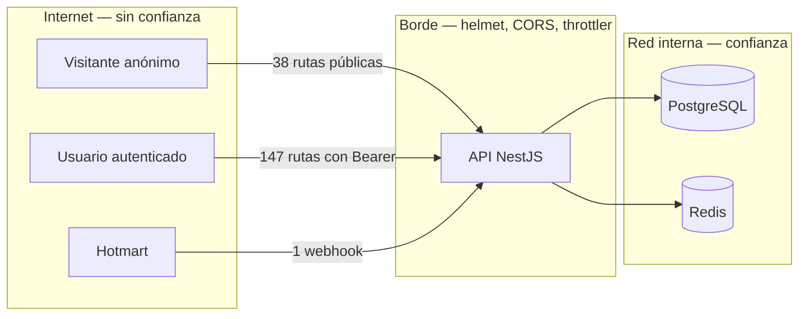

# Modelo de amenazas

Metodología STRIDE aplicada a la superficie real del backend: 189 operaciones HTTP, de las cuales
**38 son públicas y 147 exigen token**.

## Activos críticos

| Activo | Por qué importa | Dónde vive |
| --- | --- | --- |
| Datos clínicos y de salud | Categoría especial: su filtración es un daño irreparable a personas en situación vulnerable | `patient_profile`, `appointment_detail`, `appointment` |
| Credenciales de acceso | Dan acceso a todo lo anterior | `users.passwordHash` (bcrypt, 12 rondas), `refresh_token` |
| Registro de auditoría | Es la prueba de qué ocurrió | `audit_log` |
| Archivos subidos | Pueden contener documentación clínica | GCS o Cloudinary, más `file_asset` |
| Derechos de contenido de pago | Su falsificación es fraude | `downloadable_entitlement` |

## Fronteras de confianza

## Análisis STRIDE

### S — Suplantación de identidad

| Amenaza | Mitigación | Riesgo residual |
| --- | --- | --- |
| Fuerza bruta sobre el inicio de sesión | `@Throttle` de 5/min en login y 5/hora en registro y restablecimiento, sobre el global de 120/min | **Bajo.** Un atacante distribuido puede diluir el límite por IP |
| Robo de token de acceso | Vida útil de 15 minutos; emisor y audiencia validados | **Medio.** No hay revocación inmediata del *access token*; el margen es la ventana de 15 min |
| Enumeración de cuentas por el restablecimiento | La respuesta es idéntica exista o no la cuenta | Bajo |
| Webhook de Hotmart suplantado | Token compartido (`hottok`) comparado en tiempo constante; sin secreto configurado se rechaza todo; 60 peticiones/min | **Medio — ver hallazgo A-1** |

### T — Manipulación

| Amenaza | Mitigación | Riesgo residual |
| --- | --- | --- |
| Inyección SQL | Sequelize parametriza; no se concatenan consultas | Bajo |
| Parámetros no declarados en el cuerpo | `ValidationPipe` con `whitelist` + `forbidNonWhitelisted`. **No es configurable a propósito**: hacerlo opcional reabría el agujero por el que se podía reservar una cita a nombre de otra persona | Bajo |
| Cambio de esquema no controlado | `synchronize: false`; sólo migraciones | Bajo |

### R — Repudio

| Amenaza | Mitigación | Riesgo residual |
| --- | --- | --- |
| Negar haber hecho un cambio | `audit_log` recibe escrituras de diez módulos; cada transición de cita queda en su historial | Bajo |
| Correlacionar una queja con lo ocurrido | `meta.requestId` en toda respuesta y cabecera `X-Request-Id`; `x-trace-id` enlaza con OpenTelemetry | Bajo |

### I — Divulgación de información

| Amenaza | Mitigación | Riesgo residual |
| --- | --- | --- |
| Fuga de detalles internos en errores | `HttpExceptionFilter` normaliza todo; los 5xx nunca exponen la causa | Bajo |
| Datos sensibles en logs | `sanitizeForLog` redacta; los cuerpos sólo se vuelcan con `LOG_LEVEL=debug` o `trace` | **Medio.** Poner `debug` en producción vuelca cuerpos con datos clínicos |
| Datos sensibles en trazas | `span-redaction.processor.ts` limpia atributos antes de exportar | Bajo |
| Referencia directa a archivo ajeno | URL firmada con caducidad (900 s); todo acceso queda en `file_access_log` | **Medio — ver hallazgo A-2** |
| Referencia interna en la documentación | La referencia interactiva está desactivada en producción salvo `SWAGGER_ENABLED=true` | Bajo |

### D — Denegación de servicio

| Amenaza | Mitigación | Riesgo residual |
| --- | --- | --- |
| Inundación de peticiones | `ThrottlerGuard` global, **antes** de la autenticación: un atacante no autenticado no llega a consumir validación de tokens | Bajo |
| Cuerpos enormes | `HTTP_BODY_LIMIT` de 1 MB; subidas limitadas por `MAX_UPLOAD_MB` | Bajo |
| Consultas que agotan la base | `statement_timeout` de 30 s e `idle_in_transaction_session_timeout` | Bajo |
| DoS por dependencia vulnerable | Auditadas: 0 críticas/altas tras corregir `brace-expansion` y `fast-xml-parser` | Bajo — ver [seguridad de dependencias](dependency-security.md) |
| Invalidación masiva de caché | `REDIS_PATTERN_DELETE_MAX_KEYS` acota el borrado por patrón | Bajo |

### E — Elevación de privilegios

| Amenaza | Mitigación | Riesgo residual |
| --- | --- | --- |
| Acceder a una ruta administrativa sin rol | Tres guards globales; **la autorización de cada operación se publica en el contrato leyendo los decoradores**, así que una ruta desprotegida es visible en el contrato | Bajo |
| Auto-asignarse un rol | La asignación exige permiso propio y queda auditada | Bajo |
| Terapeuta activo sin aprobación | Nace en `PENDING_APPROVAL`; la aprobación es una operación administrativa | Bajo |

## Hallazgos abiertos

### A-1 · La autenticación del webhook de Hotmart no está ligada al contenido — **MEDIO**

- **Activo:** `downloadable_entitlement` — derechos de acceso a contenido de pago.
- **Superficie:** `POST /api/v1/webhooks/hotmart`, pública y de escritura.

**Lo que sí hace hoy** (verificado en
[`hotmart.adapter.ts`](../../src/modules/downloadables/hotmart.adapter.ts) y
`downloadables.service.ts:685`):

- Exige la cabecera `x-hotmart-hottok` y la compara con `HOTMART_WEBHOOK_SECRET`.
- La comparación es **en tiempo constante** (`timingSafeEqual`), así que no se puede descubrir el
  token carácter a carácter midiendo tiempos.
- **Falla cerrado:** sin `HOTMART_WEBHOOK_SECRET` configurado, *toda* notificación se rechaza. No
  existe un modo permisivo.
- Rechaza con `403 HOTMART_INVALID_SIGNATURE`.
- Es **idempotente**: `findOrCreate` sobre `(provider, eventId)` impide que reenviar la misma
  notificación conceda el acceso dos veces.
- Límite de 60 peticiones por minuto, declarado explícitamente para que el token no pueda sondearse
  a volumen desde una sola IP.

**La limitación real:** `hottok` es un **token estático compartido**, no una firma HMAC sobre el
cuerpo. La consecuencia es que la autenticación demuestra *quién llama*, pero no *que el contenido
no se ha alterado*. Quien obtenga el token —por una fuga de logs, un proxy intermedio o una copia de
la configuración— puede fabricar notificaciones arbitrarias de compra o reembolso mientras el token
siga siendo válido.

- **Mitigación recomendada:** migrar a la verificación HMAC sobre el cuerpo cuando Hotmart la
  ofrezca para esta integración. El código ya está preparado: `verifyNotification` recibe el
  `rawSignature` completo y sólo habría que sustituir la comparación por el cálculo del HMAC.
- **Compensación mientras tanto:** rotar `HOTMART_WEBHOOK_SECRET` según el
  [runbook de rotación de credenciales](CREDENTIAL_ROTATION_RUNBOOK.md) y vigilar
  `downloadable_external_event` en busca de concesiones sin venta correspondiente.
- **Aceptación:** aceptado como riesgo residual medio. **No bloquea producción**: el control existe,
  falla cerrado y es idempotente.

### A-2 · La URL firmada de archivo es transferible — **MEDIO**

- **Amenaza:** una URL firmada válida durante 900 s funciona para cualquiera que la reciba.
- **Por qué se acepta:** es el comportamiento estándar de las URL firmadas y el que permite la
  descarga directa desde el proveedor sin atravesar la API. La ventana es corta y todo acceso queda
  en `file_access_log`.
- **Compensación:** vigilar en `file_access_log` descargas del mismo archivo desde IP dispares
  dentro de la ventana.

### A-3 · `LOG_LEVEL=debug` en producción vuelca datos clínicos — **MEDIO**

- **Amenaza:** el interceptor de respuesta serializa cuerpos completos cuando el nivel es `debug` o
  `trace`, y esos cuerpos contienen perfiles de paciente y notas clínicas.
- **Mitigación:** `sanitizeForLog` redacta los campos conocidos, pero no puede conocer todos.
- **Control operativo:** `LOG_LEVEL` no debe ser `debug` en producción salvo durante una
  investigación acotada y con constancia de ello.

## Criterio de cierre

**No queda ninguna amenaza crítica sin mitigar.** Los tres hallazgos abiertos son de severidad
media, tienen control activo y quedan formalmente aceptados con su compensación:

| Hallazgo | Severidad | Estado |
| --- | --- | --- |
| A-1 · Autenticación del webhook no ligada al contenido | Medio | Aceptado con rotación de secreto y vigilancia |
| A-2 · URL firmada transferible | Medio | Aceptado; ventana de 900 s y registro de accesos |
| A-3 · `LOG_LEVEL=debug` vuelca datos clínicos | Medio | Aceptado; control operativo, no técnico |

Este modelo se revisa cuando se añada una ruta pública de escritura, cuando cambie el proveedor de
almacenamiento o cuando se incorpore una integración entrante nueva.
